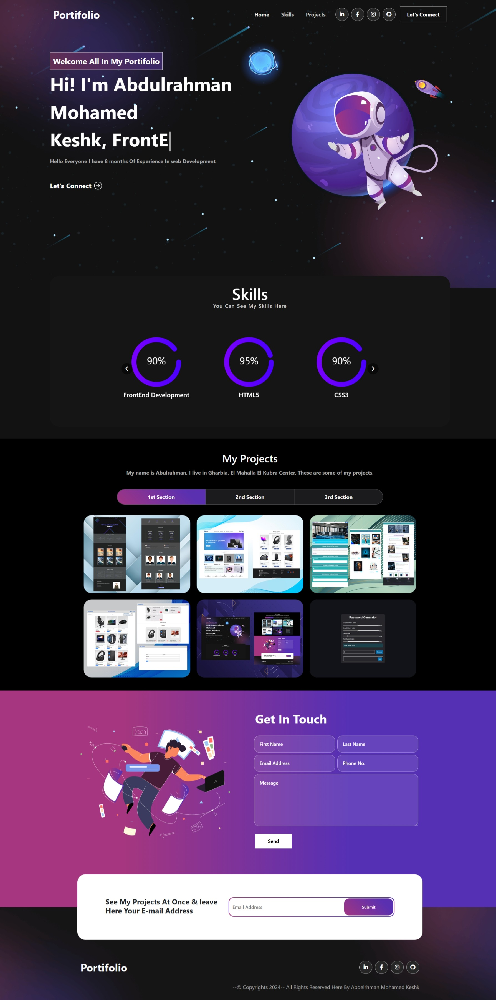

# Portfolio - Aliaa Mahmoud 🚀


[](https://reactjs.org/)
[](LICENSE)

> A modern, responsive personal portfolio website built with React.js to showcase my projects and technical skills

**[عربي](README_AR.md)** | **English**

## 🌟 


## 📋 Overview

This is an interactive personal portfolio website built with React.js. The site showcases my projects, skills, and experience in web development with a modern, responsive design.

## ✨ Features

- 🎨 **Responsive Design** - Works seamlessly on all devices (Desktop, Tablet, Mobile)
- ⚡ **Fast Performance** - Optimized for speed and performance
- 🎭 **Smooth Animations** - Interactive and engaging user experience
- 🎯 **Clean Interface** - Professional and simple UI/UX design
- 📱 **Mobile First** - Designed with mobile priority
- 🌐 **Multi-Section** - About, Projects, Skills, Contact sections

## 🛠️ Tech Stack

- **React.js** - JavaScript library for building user interfaces
- **JavaScript (ES6+)** - Core programming language
- **CSS3** - Styling and animations
- **HTML5** - Content structure
- **GitHub Pages** - Hosting and deployment

## 📁 Project Structure

```
Portifolio-App/
├── public/                 # Public assets
│   ├── index.html
│   └── favicon.ico
├── src/
│   ├── components/         # React components
│   │   ├── Header/
│   │   ├── About/
│   │   ├── Projects/
│   │   ├── Skills/
│   │   └── Contact/
│   ├── assets/            # Images and icons
│   ├── styles/            # CSS files
│   ├── App.js             # Main component
│   └── index.js           # Entry point
├── package.json
└── README.md
```

## 🚀 Installation & Setup

### Prerequisites

- Node.js (version 14 or higher)
- npm or yarn

### Getting Started

1. **Clone the repository**
```bash
git clone https://github.com/Aliaamahm0ud/My-portfolio.git
cd Portifolio-App
```

2. **Install dependencies**
```bash
npm install
# or
yarn install
```

3. **Run locally**
```bash
npm start
# or
yarn start
```

The project will automatically open at `http://localhost:3000`

4. **Build for production**
```bash
npm run build
# or
yarn build
```

5. **Deploy to GitHub Pages**
```bash
npm run deploy
# or
yarn deploy
```

## 📱 Browser Support

Tested on:

| Device | Resolution | Status |
|--------|-----------|--------|
| Desktop | 1920px+ | ✅ |
| Laptop | 1024px - 1919px | ✅ |
| Tablet | 768px - 1023px | ✅ |
| Mobile | 320px - 767px | ✅ |

## 🎯 Main Sections

### 🏠 Home
Welcome introduction with a quick overview

### 👨‍💻 About Me
Information about my background and experience

### 💼 Projects
Showcase of my key projects with live links

### 🔧 Skills
Technical skills and tools I'm proficient in

### 📧 Contact
Contact form and social media links

## 🔮 Future Enhancements

- [ ] Add Dark Mode toggle
- [ ] Integration with personal blog
- [ ] Add certifications section
- [ ] Multi-language support (Arabic/English)
- [ ] SEO optimization
- [ ] Add React Router for navigation
- [ ] Migrate to TypeScript
- [ ] Add automated testing

## 🤝 Contributing

This is a personal project, but suggestions and feedback are always welcome!

1. Fork the project
2. Create your feature branch (`git checkout -b feature/AmazingFeature`)
3. Commit your changes (`git commit -m 'Add some AmazingFeature'`)
4. Push to the branch (`git push origin feature/AmazingFeature`)
5. Open a Pull Request

## 📝 License

This project is licensed under the [MIT License](LICENSE)

## 👤 Contact


- 🌐 Portfolio: [https://github.com/Aliaamahm0ud/My-portfolio.git](https://github.com/Aliaamahm0ud/My-portfolio.git)
- 💼 GitHub: [@Aliaa Mahmoud](https://github.com/Aliaamahm0ud/My-portfolio.git)
- 📧 Email: [Add your email here]
- 🔗 LinkedIn: [Add your LinkedIn here]

## 🙏 Acknowledgments

- Thanks to the React.js community for excellent documentation and resources
- Inspired by various professional portfolio designs
- Grateful for all the feedback and suggestions

---

<div align="center">

**Made with ❤️ using React**

If you like this project, don't forget to give it a ⭐

</div>
